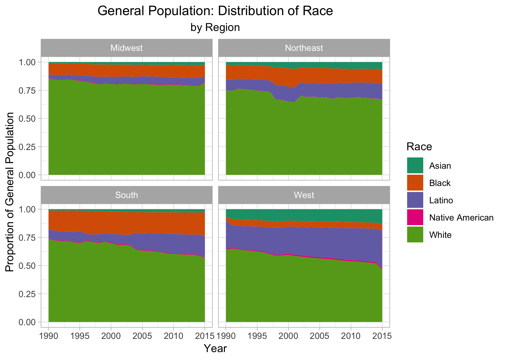
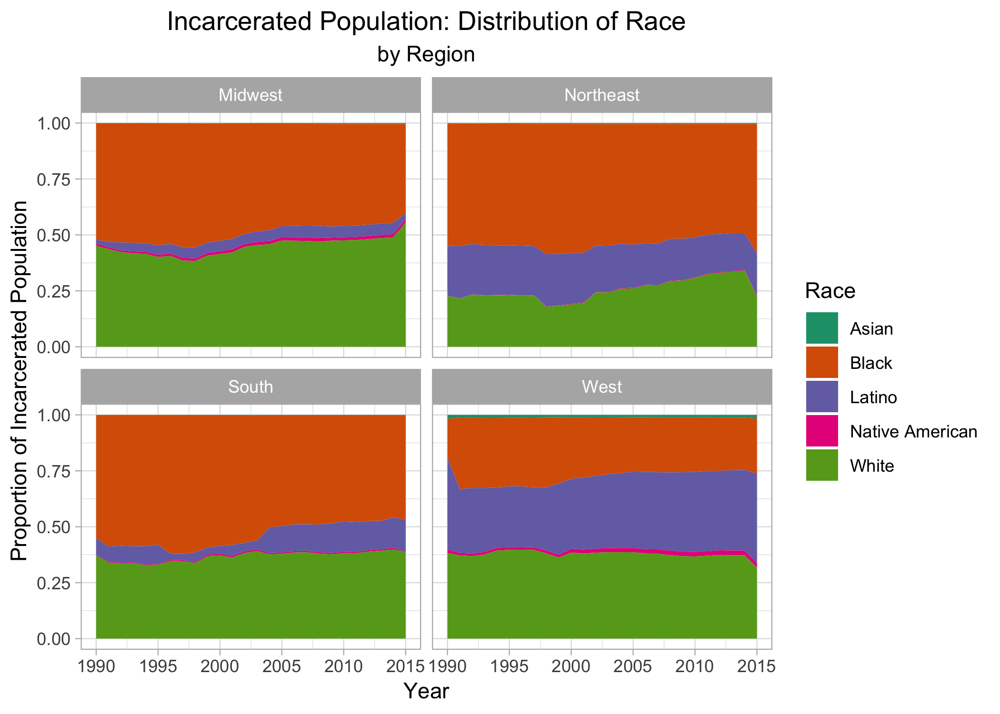

## Packages

```r
library(tidyverse)
library(readr)
```

## The Data


```r
#pretrial by race by area
prison <- read_csv("../data/2019/2019-01-22/prison_population.csv")
```


My focus in this analysis is the distribution of race over time, both in the general and incarcerated populations. Based on a quick glance at the data, it looks as if Latinos may have been included in the Other category prior to 1990. 


```r
prison_summary <- prison %>%
  filter(!is.na(prison_population)) %>%
  group_by(region, pop_category, year) %>%
  summarise(pop_tot = sum(population), prison_tot = sum(prison_population),
            perc_inc = prison_tot/pop_tot)
```


## The Plots 

The first plot displays the incarcerated rate over time. It also shows the distribution of race in the population of incarcerated people. There is a stark increase in the incarceration rate around 1990 that is worth investigating further.


```r
prison_summary %>%
  filter(!(pop_category %in% c("Female","Male","Total"))) %>%
  ggplot(mapping=aes(x=year,y=perc_inc,fill=pop_category)) + 
  geom_area() + 
  facet_wrap(~region) + 
  scale_fill_brewer(palette = "Dark2") + 
  labs(title = "Incarceration Rate",
       subtitle = "by Region", 
       x = "Year",
       y = "Incarceration Rate",
       fill="Race") + 
  theme_light()+
  theme(plot.title = element_text(hjust=0.5), 
              plot.subtitle = element_text(hjust=0.5))
```

<!-- -->


Next, I compare the distribution of race in the general and incarcerated populations. I look at these plots  1990 - 2016, after the large increase in the incarceration rate.


```r
pop_summary <- prison %>%
  filter(year >= 1990, 
         !is.na(population),!is.na(prison_population),!(pop_category %in% c("Female","Male","Total"))) %>%
  group_by(region,pop_category,year) %>%
  summarise(pop_tot = sum(population), prison_tot = sum(prison_population)) %>%
  group_by(region,year) %>%
  mutate(pop_perc = pop_tot /sum(pop_tot), prison_perc = prison_tot / sum(prison_tot),
        ratio = prison_perc/pop_perc)
```


```r
ggplot(data=pop_summary,mapping=aes(x=year,y=pop_perc,fill=pop_category)) + 
  geom_area(position="fill") + 
  facet_wrap(~region) +
  scale_fill_brewer(palette = "Dark2") + 
  labs(title = "General Population: Distribution of Race",
       subtitle = "by Region", 
       x = "Year",
       y = "Proportion of General Population",
       fill="Race") + 
  theme_light()+
  theme(plot.title = element_text(hjust=0.5), 
              plot.subtitle = element_text(hjust=0.5))
```

<!-- -->


```r
# modify file location
ggsave("general-pop.png")
```


```r
ggplot(data=pop_summary,mapping=aes(x=year,y=prison_perc,fill=pop_category)) + 
 geom_area(position="fill") + 
  facet_wrap(~region) +
  scale_fill_brewer(palette = "Dark2") + 
  labs(title = "Incarcerated Population: Distribution of Race",
       subtitle = "by Region", 
       x = "Year",
       y = "Proportion of Incarcerated Population",
       fill="Race") + 
  theme_light()+
  theme(plot.title = element_text(hjust=0.5), 
              plot.subtitle = element_text(hjust=0.5))
```

<!-- -->


```r
# modify file location
ggsave("incarcerated-pop.png")
```


